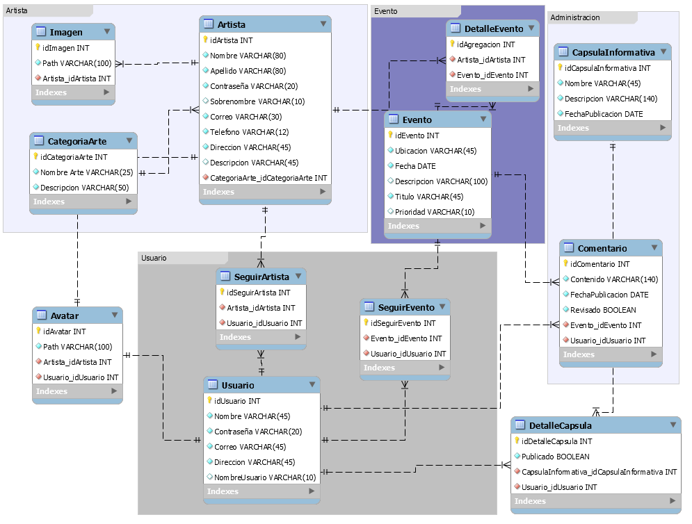

Diseño de la aplicación
=======================

Casos de Uso
------------

Se colocan los distintos casos de uso, tanto para la aplicación general como para
cada módulo.

Caso General
^^^^^^^^^^^^
.. _referencia-a:
.. image:: imagen/casoProyecto.png
 :height: 15cm
 :width: 15cm
 :scale: 100%
 :align:  center

  
Caso Artista
^^^^^^^^^^^^
.. _referencia-b:
.. image:: imagen/casoArtista.png
 :height: 15cm
 :width: 15cm
 :scale: 100%
 :align:  center
 

Caso Usuario
^^^^^^^^^^^^
.. _referencia-c:
.. image:: imagen/casoUsuario.png
 :height: 15cm
 :width: 15cm
 :scale: 100%
 :align:  center
  
 
Caso Administrador
^^^^^^^^^^^^^^^^^^
.. _referencia-d:
.. image:: imagen/casoAdmin.png
 :height: 15cm
 :width: 15cm
 :scale: 100%
 :align:  center

Diagrama de BD
--------------
En esta sección se muestra el modelo entidad-relación del sistema Formá Cultura, es una idea que disponemos para implementar la base de datos y mostrar como los datos se relacionan entre sé.

Las bases de datos son un gran pilar de la programación actual, ya que nos permiten almacenar y usar de forma rápida y eficiente cantidades enormes de datos con una facilidad inmediata.

.. _referencia-d:

